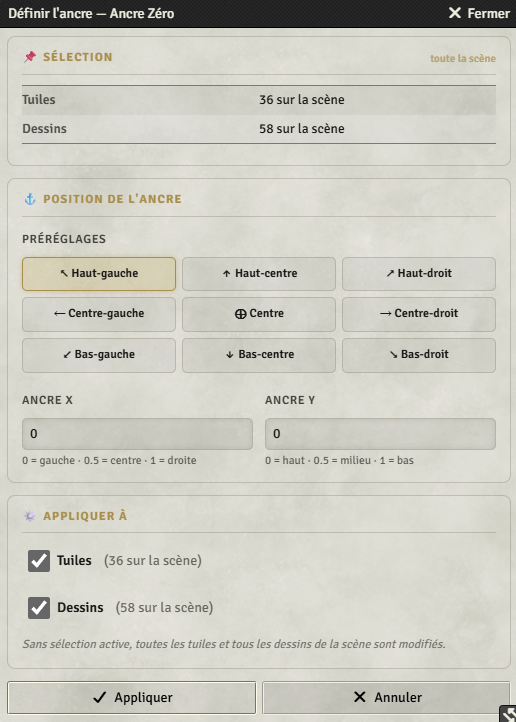
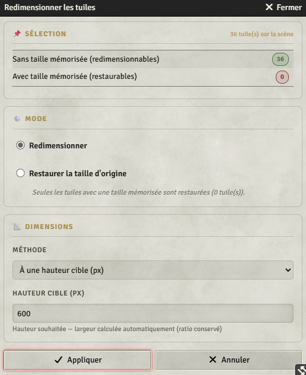
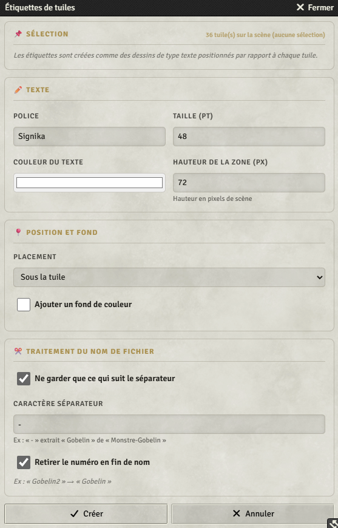
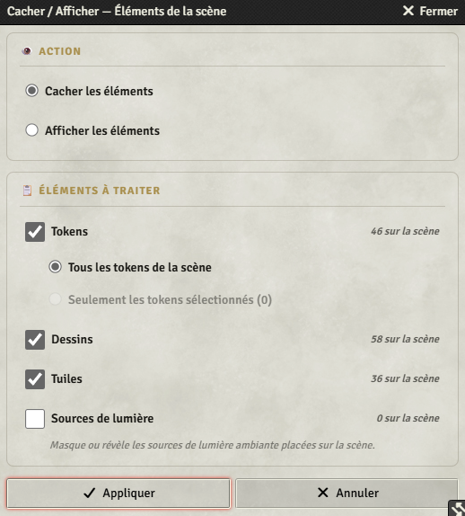
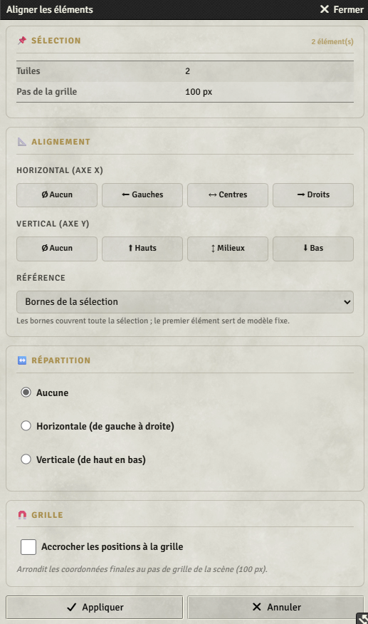
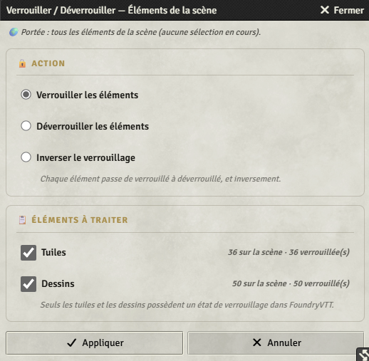
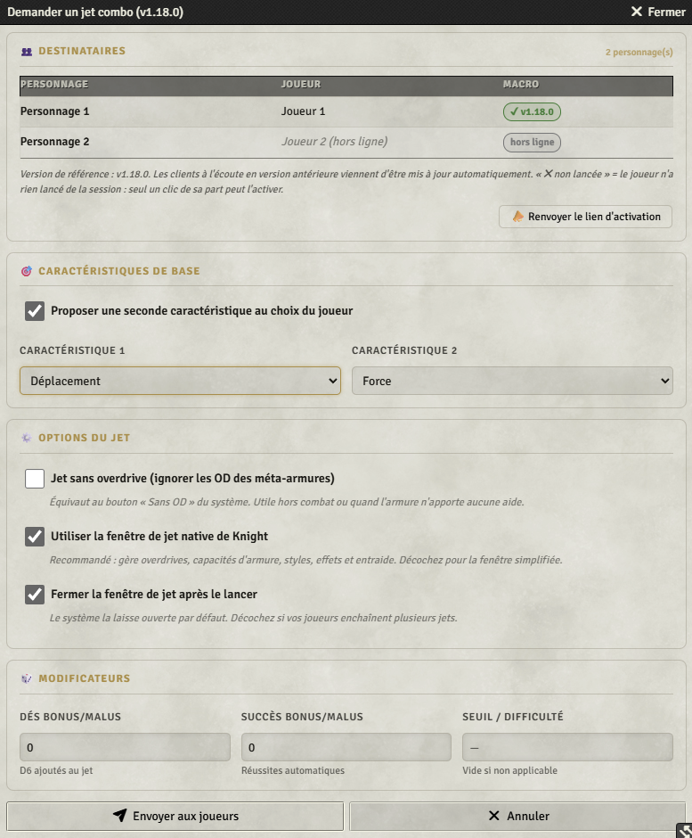
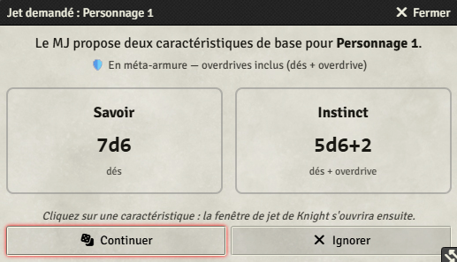

# Foundry-macros

Recueil de macros personnalisées pour [Foundry Virtual Tabletop](https://foundryvtt.com/).

La plupart des macros sont génériques et fonctionnent sur n'importe quel système de jeu. Certaines sont en revanche écrites pour un système précis (elles utilisent son API ou ses données internes) et ne fonctionneront donc que si ce système est installé et activé sur le monde Foundry.

## Compatibilité

- **FoundryVTT** : toutes les macros sont testées sur la version **v14 (build 364)**.
- **Knight** : les macros spécifiques à ce système sont testées avec la version **3.58.35**.

La version FoundryVTT (et, le cas échéant, la version du système) compatible est rappelée dans l'en-tête de chaque fichier `.js`.

## Organisation du dépôt

- [`foundry/`](foundry/) — macros génériques, indépendantes du système de jeu.
- [`knight/`](knight/) — macros spécifiques au système **Knight**.
- [`images/`](images/) — captures d'écran des macros utilisées dans ce README.

## Installation

Dans Foundry, créer une nouvelle macro de type **Script**, puis copier-coller le contenu du fichier `.js` correspondant dans l'éditeur de la macro.

---

## Macros génériques (`foundry/`)

Ces macros n'utilisent que l'API de base de Foundry et fonctionnent quel que soit le système de jeu activé.

Compatibilité : **FoundryVTT v14 (build 364)**.

### [`1-ancre-zero.js`](foundry/1-ancre-zero.js) — Définir l'ancre des tuiles/dessins

Repositionne le point d'ancrage (X/Y entre 0 et 1, `0,0` par défaut) des tuiles et des dessins : neuf préréglages rapides — coins, centres, milieu — ou saisie manuelle, avec des cases à cocher pour ne viser que les tuiles, que les dessins, ou les deux. S'applique à la sélection, ou à toute la scène si rien n'est sélectionné.

### [`2-redimensionner-tuiles.js`](foundry/2-redimensionner-tuiles.js) — Redimensionner les tuiles

Redimensionne les tuiles (sélection, ou toute la scène si rien n'est sélectionné) en conservant leur ratio : à une **hauteur cible**, à une **largeur cible**, ou à un **pourcentage** de la taille actuelle. La taille d'origine étant mémorisée dans un flag au premier redimensionnement, un mode **« Restaurer la taille d'origine »** permet de revenir en arrière à tout moment.

### [`3-etiquettes-tuiles.js`](foundry/3-etiquettes-tuiles.js) — Étiquettes de tuiles

Crée sous ou au-dessus de chaque tuile un dessin de type texte reprenant le nom de son fichier image. Police, taille, couleur, hauteur de la zone et fond de couleur optionnel sont paramétrables ; le nom peut être nettoyé au passage — ne garder que ce qui suit un séparateur, retirer le numéro final (`monstre-gobelin-03.webp` → `gobelin`).

### [`4-cacher-scene.js`](foundry/4-cacher-scene.js) — Cacher / afficher la scène

Cache ou affiche en masse les tokens, dessins, tuiles et sources de lumière ambiante de la scène, chaque catégorie se cochant indépendamment (pour les tokens : tous ceux de la scène, ou seulement les sélectionnés). Pratique pour préparer une scène puis la dévoiler progressivement.

### [`5-alligner-elements.js`](foundry/5-alligner-elements.js) — Aligner les éléments

Aligne les **tuiles**, **dessins** et **tokens** sélectionnés (deux au minimum, le type étant détecté depuis la sélection) sur l'axe horizontal (bords gauches, centres, bords droits) et/ou vertical (bords hauts, milieux, bords bas), en prenant comme référence les **bornes de la sélection** ou le **premier élément sélectionné**. Une **répartition** horizontale ou verticale complète l'alignement — espaces égaux entre les éléments, ou écart fixe en pixels — et les positions finales peuvent être **accrochées à la grille** de la scène.

### [`6-verrouiller-elements.js`](foundry/6-verrouiller-elements.js) — Verrouiller / déverrouiller les éléments

Verrouille, déverrouille ou **inverse** l'état de verrouillage des **tuiles** et des **dessins**, chaque catégorie se cochant indépendamment. S'applique à la sélection en cours, ou à toute la scène si rien n'est sélectionné ; la fenêtre rappelle la portée retenue et le nombre d'éléments déjà verrouillés. Un élément verrouillé ne peut plus être déplacé, redimensionné ni supprimé sur le plateau. (Les tokens et les sources de lumière n'ont pas d'état de verrouillage dans Foundry : pour les masquer, voir `4-cacher-scene.js`.)

---

## Macros spécifiques à un système

### Knight

Système : [Knight (foundry-knight)](https://github.com/Zakarik/foundry-knight)

Ces macros utilisent l'API et les données du système Knight (`CONFIG.KNIGHT`, `game.knight`, etc.) et ne fonctionneront pas sur un autre système.

Compatibilité : **FoundryVTT v14 (build 364)** · **Knight v3.58.35**.

#### [`k1-jet-combo-groupe-2carac.js`](knight/k1-jet-combo-groupe-2carac.js) — Jet combo Knight (demande groupée MJ → Joueurs)

Le MJ demande en une seule action un jet combo (deux caractéristiques, parfois trois) à plusieurs joueurs : chacun reçoit sur son écran une fenêtre pour compléter puis lancer son propre jet. Tout passe par le canal socket du système, sans module tiers.

**Activation** — chaque joueur lance la macro une fois par chargement de page pour recevoir les demandes. Le MJ n'a pas à y penser : à chaque exécution, la macro remet à niveau les clients à l'écoute et chuchote un lien d'activation en un clic à ceux qui sont hors de portée. Lancée sans token sélectionné, elle ne fait que cela.

**Fenêtre du MJ** — un tableau donne l'état de la macro chez chaque joueur destinataire. Le MJ choisit une caractéristique de base (ou deux, au choix du joueur), la **fenêtre de jet native de Knight** ou une **fenêtre simplifiée**, un jet **sans overdrive**, la fermeture automatique de la fenêtre après le lancer, puis des dés et succès bonus/malus et un seuil de difficulté.

**Côté joueur** — la fenêtre native de Knight s'ouvre base pré-remplie, précédée s'il y a lieu du choix entre les deux caractéristiques proposées, chacune avec son nombre de dés. La fenêtre simplifiée, elle, lui fait choisir ses caractéristiques puis poste le résultat détaillé dans le chat.

Le calcul suit le système : les dés lancés correspondent à la **somme des caractéristiques**, et l'overdrive n'ajoute pas de dé mais des **réussites automatiques**, uniquement en méta-armure ou en ascension.

**Aperçu :**

Fenêtre du MJ :

Fenêtre reçue par le joueur :

